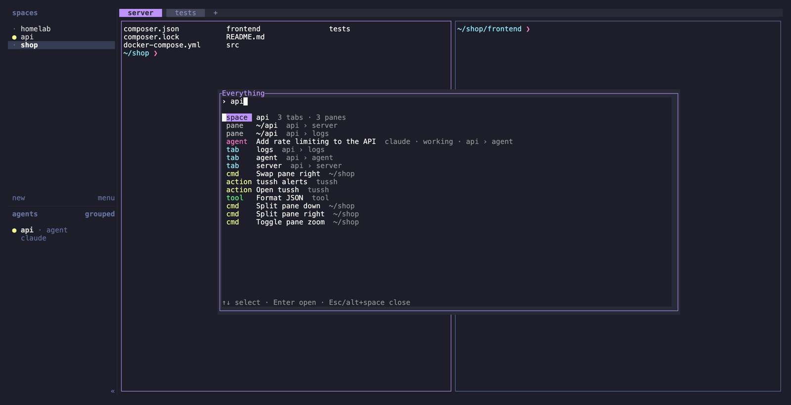
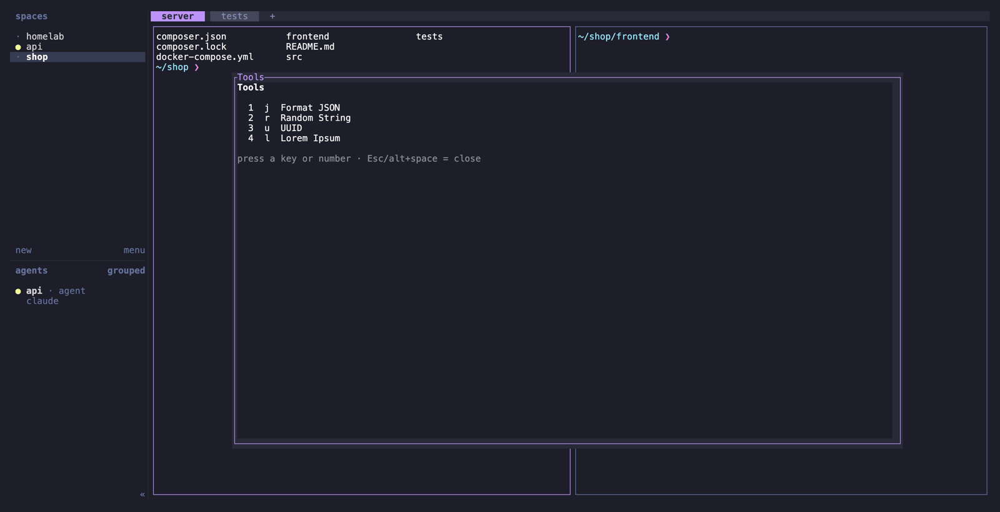
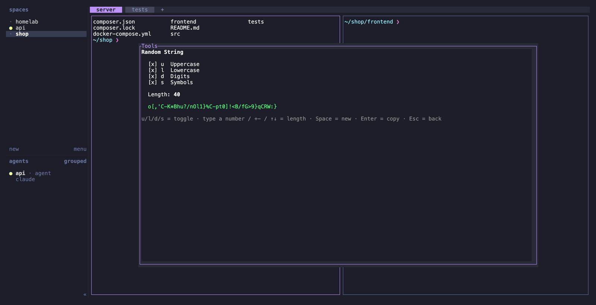

# herdr-everything

"Search Everywhere" for [herdr](https://herdr.dev), inspired by JetBrains IDEs, with a few dev tools built in. Press **alt+space**, type a few letters and hit **Enter**.



| Kind | Enter does |
|---|---|
| `agent` | Focus the agent's pane |
| `space` | Focus the workspace |
| `tab` | Focus the tab |
| `pane` | Focus the pane (titled by its directory) |
| `cmd` | Run a herdr command on the pane you came from: new/rename/close workspace or tab, split, zoom, focus/swap/resize in a direction, move pane to a new tab or workspace, rename/close pane, new worktree. Renames ask for a name, closing asks for confirmation. |
| `tool` | Open a built-in tool right in the popup |
| `action` | Invoke an action of any installed plugin |

Search is fuzzy and word-based, e.g. `rand`, `split right`, `shop front`. Matches in the title count double.

Keys: **↑↓** or **ctrl+p/n** select · **Enter** open · **alt+backspace / ctrl+w** delete word · **ctrl+u** clear · **Esc / alt+space** close.

## Tools

Things you would otherwise open a website for. The result is copied to the clipboard.

<p>
  
  
</p>
<p><em>The tools menu (left) and Random String with symbols and a length of 40 (right).</em></p>

| Key | Tool | |
|---|---|---|
| `j` | Format JSON | paste JSON (Enter = use clipboard), shown colored in `less` |
| `r` | Random String | `u` `l` `d` `s` toggle upper/lower/digits/symbols, type a number or use `+-` `↑↓` for the length |
| `u` | UUID v4 | |
| `l` | Lorem Ipsum | `+-` or a number for paragraphs |

In every tool: **Enter** copy & close · **Space** regenerate · **Esc** back · **alt+space** close. Open the tool menu directly via the `herdr-everything.tools` action, or just search for the tool.

## Requirements

`python3` (standard library only). Format JSON needs `jq`. Clipboard: `pbcopy` (macOS), `wl-copy` (Wayland) or `xclip` (X11).

## Install

```sh
herdr plugin install baeroe/herdr-everything
```

Add key bindings to `~/.config/herdr/config.toml`:

```toml
[[keys.command]]
key = "alt+space"
type = "plugin_action"
command = "herdr-everything.open"
description = "everything"

# optional: tools menu
[[keys.command]]
key = "alt+t"
type = "plugin_action"
command = "herdr-everything.tools"
description = "tools"
```

Then run `herdr server reload-config`.

## Tests

```sh
python3 test_search.py      # search ranking and commands, no herdr needed (runs in CI)
python3 test_everything.py  # drives the search UI in a pseudo-terminal against a running herdr
python3 test_tools.py       # drives the tools in a pseudo-terminal (macOS clipboard)
```

## Screenshots

The screenshots are generated with [VHS](https://github.com/charmbracelet/vhs) from the tapes in `docs/tapes/`, against a throwaway herdr server with demo data (your own herdr is not touched):

```sh
bash docs/screenshots.sh          # all, or e.g. `bash docs/screenshots.sh search`
```

## License

MIT, see [LICENSE](LICENSE).
